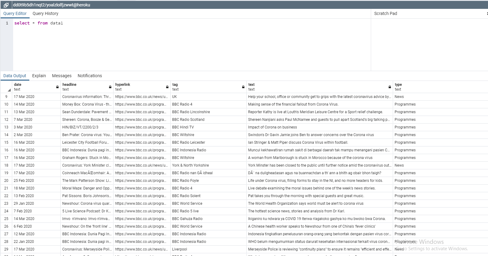
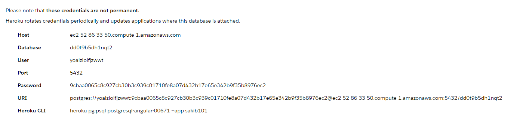
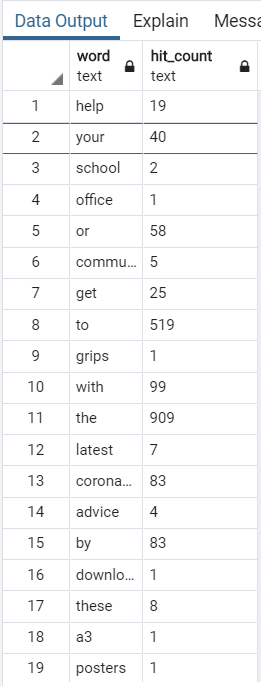

# <h1>BBC_Scrape</h1>
A python based web scrapping tool. That scrapes https://www.bbc.co.uk/search?q=coronavirus using Scrapy(http://scrapy.org/) framework.
There are usually 29 pages in every search reasult for BBC.com and the script can scrape through all of those pages. But it only scrapes 
and stores news and programmes <b>'Headings', 'Date', 'Tag', 'Article_text', 'Link' </b> that occured after 8th December 2019 which is the 
probabale date for the outbreak.

# <h1>Data Storing</h1>
The scraped data is saved both in a local .csv file and also in an online hosted database. Both the links are mentioned below:
<h3><b>-CSV format</b></h3>Here is the output file : https://github.com/h0oni/BBC_Scrape/blob/master/BBC_Scrape_data_engineer/Database/item.csv
<h3><b>-Online server</b></h3>
The database <b>(Postgresql)</b> is hosted on <b>[heroku.com]</b>(www.heroku.com). Some Screen shots of the data and the login credential is given below:
<h4><b>Scraped data:<b><h4>

<h4><b>Credintials:</b><h4> In <b>.txt</b> format: https://github.com/h0oni/BBC_Scrape/blob/master/BBC_Scrape_data_engineer/Database/credentials.txt

**The online database craetion is done with another script not directly from pipeline.py of scrapy.

# <h1>Bonus-Analytics</h1>
A very simple word hit counter is written in this script https://github.com/h0oni/BBC_Scrape/blob/master/BBC_Scrape_data_engineer/Bonus_Analytics/Word_hit_count.py 
. The script takes all the news article data into a string then clears all the less important punctuations and also converts all the words to lower-case
then with the help of a <b>Hash table (Dictionary) <b> the hit count is generated. Then the data is saved both on a .csv file and also in the server.
<h3><b>-CSV format</b></h3>Here is the output file : https://github.com/h0oni/BBC_Scrape/blob/master/BBC_Scrape_data_engineer/Bonus_Analytics/analytics.csv
<h3><b>-Online server</b></h3>

